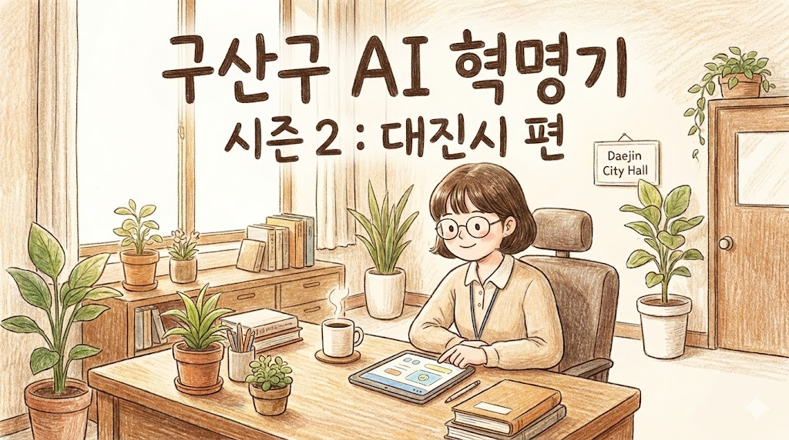

# 🎤 구산구 AI 혁명기 시즌 2: 대진시 편

> **"구산구 모델은 구산구용이야. 대진시에는 대진시 모델이 필요해."** 구산구청의
> 혁신은 끝이 아니었다. 그 불씨가 대진시로 옮겨붙다. 신규 공무원 윤서연, 거대한
> 관료주의의 벽을 AI로 넘어서다.

 

## 📖 읽으러 가기

대진시청을 배경으로 한 시즌 2의 새로운 이야기를 만나보세요.

### 👉 [웹소설 시즌 2 읽으러 가기 (Click)](index.html)

 

---

## 🧐 작품 소개 (Synopsis S2)

**핵심 갈등:**  
구산구청의 AI 혁신 성공 사례를 대진시청에 적용하려는 신입 주무관 **윤서연**. 하
지만 대진시의 복잡한 조례와 경직된 조직 문화는 구산구와는 차원이 다르다. 단순히
따라 하는 것으로는 해결되지 않는 문제들 앞에서, 서연은 자신만의 AI 활용법을 찾아
내야 한다.

**확장된 메시지:**  
혁신은 한 곳에서 멈추지 않는다. 환경에 맞게 진화하고 확산될 때 진정한 가치를 발
휘한다.

### ✨ 시즌 2 관전 포인트

1.  **적용과 응용**: 이미 만들어진 매뉴얼을 낯선 환경에 어떻게 적용할 것인가?
2.  **신구 조화**: 20대 신규 공무원(MZ)과 50대 베테랑 실장(X세대)의 티키타카.
3.  **Advanced Tech**: 단순 ChatGPT를 넘어, Custom GPT와 조직 차원의 AI 내재화
    과정.
4.  **성장의 확산**: 한 명의 천재(강민준 S1)가 아닌, 시스템과 문화(윤서연 S2)로
    의 발전.

 

## 👥 캐릭터 프로필 (Season 2)

### 윤서연 (26세, 주인공)

- **소속**: 대진시청 민원봉사과 8급
- **성격**: 배우려는 열정이 가득함. 실패를 두려워하지 않는 긍정 에너지.
- **무기**: 끈기와 AI 독학 능력.

### 정민수 (52세, 실장)

- **소속**: 대진시청 민원봉사과 실장
- **성격**: 겉으론 무뚝뚝하지만 속은 따뜻함. "라떼는"을 시전하지만 합리적인 조언
  자.
- **Role**: 서연의 방패막이가 되어주며 AI의 효용성을 인정하게 됨.

### 강민준 (30세, S1 주인공)

- **Role**: 전화 너머의 멘토. 서연이 길을 잃을 때마다 데이터 기반의 방향성을 제
  시.

 

## 📚 시즌 2 에피소드 목차

|  Episode  | Title                 | Key Tech                              |
| :-------: | :-------------------- | :------------------------------------ |
| **Ep 1**  | **새로운 시작**       | 타 지역 사례 분석 / ChatGPT Role Play |
| **Ep 2**  | **현실의 벽**         | 조례 비교 분석 / 규제 검토            |
| **Ep 3**  | **첫 돌파구**         | 민원 데이터 패턴 분석                 |
| **Ep 4**  | **중앙정부와의 만남** | 공문서 자동 생성 / 양식 최적화        |
| **Ep 5**  | **조직의 저항**       | 변화 관리(Change Management) 프롬프트 |
| **Ep 6**  | **첫 성과**           | 성과 지표(KPI) 시각화                 |
| **Ep 7**  | **역풍**              | 보안 가이드라인 준수 / 리스크 관리    |
| **Ep 8**  | **반격**              | Custom GPT 구축 (대진시 전용)         |
| **Ep 9**  | **최종 대결**         | 대규모 데이터 처리 / 실시간 데모      |
| **Ep 10** | **확산**              | 사내 AI 교육 커리큘럼 / 매뉴얼 제작   |

 

## 🛠 Tech Stack

- **Core:** HTML5, CSS3, Vanilla JavaScript
- **Data:** Markdown based content management
- **Build:** Python conversion script

---

**Gu-san District AI Revolution Project Season 2**
